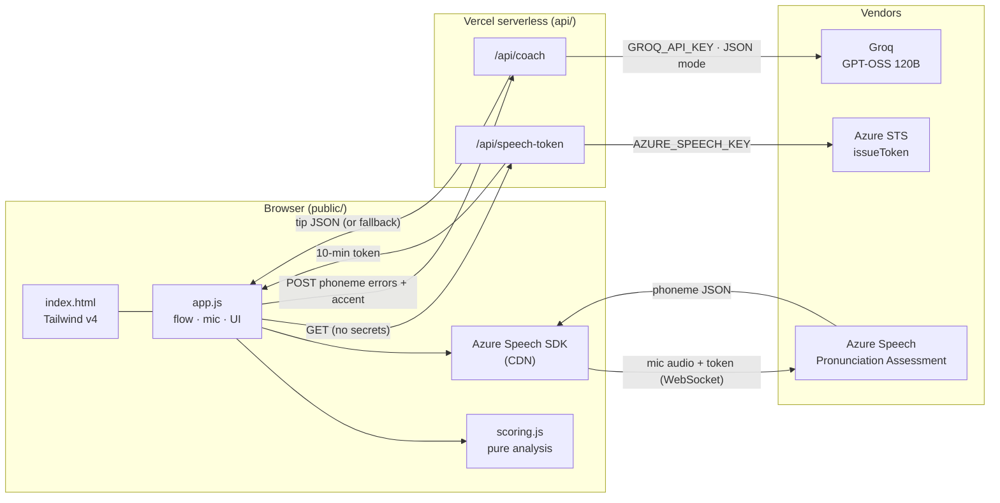
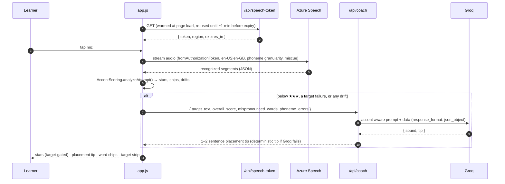

# Accent Coach

**Phoneme-level English pronunciation practice with an AI coach — open the link, tap the mic, get scored.**

No sign-up, no setup for learners. Each attempt is scored sound-by-sound by Azure AI Speech Pronunciation Assessment. When something drifts (/θ/ said as /s/, /w/ as /v/), an LLM on Groq turns the raw phoneme data into one warm, physical, practisable tip.

[](https://vercel.com/new/clone?repository-url=https%3A%2F%2Fgithub.com%2Fyvette-moss%2Faccent-coach&env=AZURE_SPEECH_KEY,AZURE_SPEECH_REGION,GROQ_API_KEY&envDescription=Azure%20Speech%20key%2Fregion%20for%20scoring%2C%20Groq%20key%20for%20coaching&envLink=https%3A%2F%2Fgithub.com%2Fyvette-moss%2Faccent-coach%23setup)

> **Where this sits.** This is v2 of the [Accent Trainer MVP prototype](https://github.com/yvette-moss/accent-trainer-mvp). That prototype proved the practice loop with free browser speech-to-text and *documented* that it couldn't hear the errors that matter: its golden set showed "three" said as "tree" earning ★★★. This version replaces text matching with phoneme-level scoring, and its golden set proves the fix.

---

## What a learner sees

1. **Pick a target accent** in the top bar: 🇺🇸 General American (`en-US`, default) or 🇬🇧 British RP (`en-GB`). It sets Azure's recognition benchmark and the voice used by **Listen**, and is remembered in the browser.
2. **One card at a time.** "Exercise 3 of 17", with the target text, a one-line articulation cue and a **Listen** button. *Next Phrase* and *Try Again* only — no menus.
3. **Record → stop.** Recording also stops on its own once every target word has been heard.
4. **Stars + label, gated by the target sound.** ★★★ *Mastered! Clear & natural.* (overall ≥ 85 **and** every target sound ≥ 80) · ★★☆ *Good effort! Minor accent drift.* (65–84) · ★☆☆ *Needs practice! Focus on tongue placement.* (< 65, **or** any target sound failed). When a target sound caps the rating, one line says why, e.g. *Capped at ★☆☆: /θ/ in "Think" was heard as /s/ (30).*
5. **One placement tip, right under the rating** (only when needed), e.g. */θ/ Rest the tip of your tongue lightly between your front teeth and blow air out gently — no voice.* No extra drills or word pairs to practise outside the exercise.
6. **Word chips.** Green ≥ 80, amber 60–79, red < 60. A word whose target sound failed gets a red outline and dot. Tap a chip to see each phoneme's score with the target phonemes outlined, and the drift, e.g. *Expected /θ/ → heard /s/*. Skipped words and extra words ("um") are marked.
7. **Target sounds strip.** Every target-sound check for the exercise (e.g. *Think /θ/ → /s/ 30*, *wide /w/ 72*), green/amber/red at a glance.
8. **Fluency and prosody** as quiet progress bars (prosody shows *n/a* for British English — see below).
9. **Finish & Export.** A summary (phrases practised, average stars, top 2 trouble sounds) and **Download Session Analytics (.CSV)**.

## Architecture





### Design decisions

| Decision | Why |
|---|---|
| **Backend-for-frontend, two tiny functions** | The only server-side jobs are swapping a key for a token and calling an LLM. No framework, no database, no runtime dependencies (`package.json` has zero). |
| **Ephemeral Azure tokens** | The browser streams audio directly to Azure (low latency, no audio passes through Vercel), using a 10-minute token. The subscription key never leaves the function. A warm instance re-uses one token for up to 5 minutes. |
| **Scoring is a pure module** | `public/scoring.js` has no DOM, network or SDK code. The same file runs in the browser and in the Node evals, so the evals test exactly what ships. |
| **Groq behind validation and a fallback** | The LLM output is checked for shape and length. If it's malformed, slow (> 8 s), rate-limited or not configured, a phoneme-specific tip from a reviewed library is returned instead. Learners always get a tip, and the response says which path produced it. |
| **Model chain** | Groq retires models on short notice — `llama-3.3-70b-versatile`, the original choice, now returns `model_not_found`. If `GROQ_MODEL` is rejected (400/404) or returns invalid JSON, the function retries once with `GROQ_FALLBACK_MODEL` within the same time budget, and logs every failed attempt with Groq's error code so a retirement can't hide behind the retry. |
| **Reasoning budget** | The gpt-oss models reason before answering, and that hidden reasoning counts towards the token limit. The coach uses `reasoning_effort: "low"` and a 1,024-token budget so the JSON answer is never cut off. |
| **Content is data** | `src/phrases.json` is validated at build time (unique ids, phrase-only with per-section word counts, focus sounds within the curriculum, a cue on every item, contrast pairs present), so bad content fails the deploy, not the learner. |

### Security model

- **No secrets client-side.** Keys live only in Vercel environment variables. Tests assert that neither handler ever echoes a key or upstream error body.
- **Origin guard.** If an `Origin` header is present, it must match the deployment host (or `ALLOWED_ORIGINS`). This stops other sites hot-linking your quota from their visitors' browsers.
- **Rate limiting.** Per-IP fixed windows (30 tokens / 40 coach calls per 10 min, configurable). The limiter is in-memory per warm instance: free and dependency-less, but best-effort. Swap in Vercel KV/Upstash if you need global limits.
- **Input hardening.** `/api/coach` caps the body at 8 KB, strips control characters, clamps scores and truncates arrays. The system prompt tells the model to treat user data as data.
- **Strict headers.** CSP (scripts only from self + jsDelivr, no `unsafe-inline`/`unsafe-eval` for scripts, connections only to Azure), `Permissions-Policy: microphone=(self)`, `X-Frame-Options: DENY`, `nosniff`. The local dev server applies the same headers from `vercel.json`, so a CSP mistake shows up before you deploy.
- **Honest limit:** anyone can call a public endpoint with curl. The real backstops are the Azure F0 free tier's hard monthly cap and Groq's free-tier limits. If you upgrade to paid tiers, set budget alerts.

## Scoring model

| Rule | Value | Rationale |
|---|---|---|
| Stars | ★★★ overall ≥ 85 **and** weakest target sound ≥ 80 · ★★☆ overall 65–84 (or ≥ 85 with a weakest target of 65–79) · ★☆☆ overall < 65 **or** any target-sound failure | Azure's `PronScore` rewards intelligibility: "Sink outside the box" is perfectly understandable and scored ★★☆ under the old bands. The exercise's target sounds now gate the rating (GD-02, GD-04). |
| Target sounds | For each exercise, `target_words` (in `src/phrases.json`) × its `focus` sounds, e.g. the /θ/ in *think* and the /s/ in *sink*. Function words such as *the* are deliberately not gated (weak forms are a later topic) | Gating only the sounds the exercise is about keeps it strict without punishing unrelated slips: a red *and* in "Through thick and thin" doesn't cap the stars (GD-06). |
| Target-sound failure | Target phoneme < 65, **or** Azure's top `NBestPhonemes` candidate is a different phoneme (substitution), **or** the target word was skipped (omission) or replaced by another word | Caps the attempt at ★☆☆, outlines the word in red and explains the cap in one line. Azure doesn't report insertions *inside* a word; an inserted extra word ("um") is shown as an extra chip but isn't a target failure on its own. |
| No phoneme names | If Azure returns a target word's phonemes without names (Azure documents IPA phoneme names for `en-US` only), the gate uses that target word's score instead | The check never silently passes; the UI says "checked at word level" (GD-06). |
| Rounding | Round to an integer **before** banding | 84.5 shows as "85", so it is eligible for ★★★. The number and the stars can never disagree (golden case GD-01). |
| Word chips | Green ≥ 80 · amber 60–79 · red < 60 on word `AccuracyScore` | Hyphenated words are folded back into one chip and scored by their **weakest** part (GD-03). |
| Phoneme drift | Phoneme `AccuracyScore` < 60. "Produced" = top `NBestPhonemes` candidate when it differs from the target | Gives the learner "expected /θ/ → heard /s/", not just "low score". |
| Miscue detection | **On** for every exercise (the curriculum is phrase-only) | Catches skipped and extra words (GD-05). A mispronounced word that Azure still aligns to the reference keeps its phoneme-level evidence (GD-02); if Azure instead reports it as a different word, it is shown as a substitution ("heard as …") only when the two words look alike, so fillers like "um" are never mistaken for the target. |
| Continuous recognition | Re-align all segments to the reference (LCS), drop Azure's per-segment omissions, word-weight fluency/prosody, recompute completeness, and aggregate overall as 0.4 × lowest + 0.2 × each other component | Azure scores every segment against the *whole* reference, so a naive merge marks half the sentence as skipped (GD-05). |
| Miscue / mispronunciation | Phoneme granularity, `enableMiscue = true` (4th argument of `PronunciationAssessmentConfig`) | The JS SDK has no separate `enableMispronunciation` flag: word-level `Mispronunciation` labels are always returned, and miscue adds `Omission`/`Insertion`. |
| Coaching trigger | below ★★★ **or** any target failure **or** any drift **or** any non-green word | A ★★★ attempt with a red non-target word still gets a tip (GD-06); the tip always prefers a failed target sound, then the weakest target. |

### Target accents

| | 🇺🇸 General American | 🇬🇧 British RP |
|---|---|---|
| Recognition language | `en-US` | `en-GB` |
| Phoneme alphabet | IPA | IPA requested and accepted, but phonemes come back with **empty names** (if Azure ever rejects it, the app drops it for the session and asks the learner to record again) |
| Spoken-phoneme candidates (`NBestPhonemes`) | 5 | not requested (Azure documents them for `en-US` only), so drifts can't say *heard /s/* |
| Prosody score | on | on (Azure's docs say `en-US` only, but the live service returns it for `en-GB` too) |
| Target-sound gate | per phoneme | per phoneme if Azure names the phonemes, otherwise per target word |
| Model voice (**Listen**) | best installed `en-US` voice (e.g. Samantha) | best installed `en-GB` voice (e.g. Daniel); if none is installed the hint says so and the closest English voice is used |
| Coaching prompt | General American placement | Standard Southern British / RP placement |

**Switching accent re-scores the same recording.** Every recording is also captured as 16 kHz WAV in the browser (never uploaded anywhere except Azure). When the learner changes the accent while a result is on screen, that WAV is sent to Azure again with the new benchmark and the result, tip and badge (*scored as 🇬🇧 RP*) update in place — so the effect of the toggle is visible immediately. Without a usable recording, the stale result is cleared and the learner is asked to record again.

**What the British benchmark can and can't do (measured, Oct 2026).** Feeding the same Azure neural-voice recordings to both benchmarks:

| Recording | Scored as GenAm (`en-US`) | Scored as RP (`en-GB`) |
|---|---|---|
| British voice, "Her teacher parked the car near the river after work." | words 88–100, overall 94.7 | words 99–100, overall 91.8 |
| American voice, same sentence | words 94–100, overall 95.6 | words 99–100, overall 92.4 |
| American voice, "Think outside the box." | /θ/ 91–92, overall 95 | *think* 100 (no phoneme detail), overall 92 |

The GenAm benchmark does notice a British accent (e.g. *her* 88), but the RP benchmark scores an American accent as near-perfect and gives no phoneme names. So in RP mode the target-sound gate works per word and is lenient; the strict /θ/ /ð/ checks are reliable in GenAm mode. These were synthetic voices, so treat the numbers as indicative.

## Pedagogy

- **Phrases only, three stages.** Every exercise is a natural multi-word chunk — no isolated words. The 17-exercise session targets B1 **/θ/** (voiceless, *think*) and **/ð/** (voiced, *the*) in three stages:
  1. **Everyday phrases (3–5 words)**, e.g. *Think outside the box.*, *Through thick and thin.*, *Smooth as leather.* — one sound in a chunk learners actually say.
  2. **B1 sentences (6–10 words)**, e.g. *We need a thorough method to measure team growth.* — several /θ/ and /ð/ sounds in connected speech, where they are most often dropped.
  3. **Contrast drills**: /θ/–/s/ (*think … sink*, *breath … pass*), /ð/–/d/ (*they dare … there*), /θ/–/t/ (*three tall trees*), /w/–/v/ (*wide … view … valley*).

  `npm run build` enforces this: it rejects any exercise under 3 words, everyday phrases outside 3–5 words, sentences outside 6–10, and focus sounds outside /θ ð s d t w v/.
- **One correction at a time.** The coach picks one sound — a failed target first, then the weakest target, then the most frequent drift — and gives one or two sentences of placement for it. A list of five problems after a 3-second recording discourages learners and doesn't help them change anything.
- **Physical cues, not phonetics jargon.** "Tongue tip between the teeth, blow, no voice" is something a learner can act on. "Voiceless dental fricative" isn't.
- **Practise what gets scored.** Contrast pairs live inside the exercises (the contrast drills) rather than in the feedback, and the feedback never suggests a separate tongue twister the learner can't record or be scored on. The tip sits directly under the rating so the learner reads it, then taps *Try Again*.
- **Strict where it matters.** Stars are gated by the exercise's target sounds, not by overall intelligibility, so ★★★ means the /θ/ was actually there. Unrelated slips still show up in the chips without capping the rating.
- **No inflated praise.** The coach never mentions scores or praise; the label tone follows the stars.
- **Position matters.** Items record where the target sound sits (initial, medial, final or mixed), because learners often get /θ/ right at the start of a word and lose it at the end ("growth" → "grow").

## Golden dataset & evals

`evals/golden_dataset.json` holds six benchmark cases. Each one is real-shaped Azure JSON plus hand-derived expectations, and each targets an edge case where a plausible implementation gets the answer wrong. The eval also checks that every case's `exercise_id` and text match an exercise in `src/phrases.json`, so the benchmark can't drift from the curriculum:

| ID | Edge case | Expected |
|---|---|---|
| GD-01 | `PronScore` 84.5 on "Breathe in fresh air.", /ð/ 82 | displays 85 · ★★★ · no tip |
| GD-02 | "Think outside the box." scores 78 overall, but think's /θ/ → /s/ (30) | **capped ★☆☆** · cap reason · tip for /θ/ |
| GD-03 | "thirty-three" split into two Azure words, both θ→t | one red chip (weakest part) · two target failures · ★☆☆ |
| GD-04 | Strong contrast drill (90), weakest /w/ in *wide* 72 | ★★☆, not ★★★ (dual gate) · tip for /w/ |
| GD-05 | Two segments, skipped target word *throbbing*, filler "um" | 1 omission · 1 insertion · overall 76 worked out by hand · capped ★☆☆ |
| GD-06 | `en-GB`-style result with unnamed phonemes; non-target *and* is red | word-level gate (weakest 84) · ★★★ · tip still triggered · prosody n/a |

```bash
npm test             # 17 handler unit tests (mocked network) + golden evals
npm run eval         # golden evals only
npm run eval:live    # also hits a running /api/coach with real Groq and checks the LLM output
                     # contract: { sound, tip }, tip 1–2 sentences ≤ 240 chars, no word pairs or
                     # quoted drills, coaches the expected sound, source=groq
```

The first eval run caught a real bug: the filler "um" was being paired with the skipped word "throbbing" as a substitution. Substitutions now require a look-alike word (normalised edit similarity ≥ 0.4), and fillers are never paired.

## Setup

### 1. Get the keys (both have free tiers)

**Azure AI Speech: required.**
1. Create a free Azure account at <https://azure.microsoft.com/free/>.
2. In the Azure portal: **Create a resource → Speech** (listed under *Azure AI services*).
3. Choose a region (e.g. `westeurope`, `eastus`) and the **Free F0** pricing tier.
4. Open the resource → **Keys and Endpoint**. Copy **KEY 1** → `AZURE_SPEECH_KEY` and **Location/Region** → `AZURE_SPEECH_REGION`.

The F0 tier includes 5 audio hours of speech-to-text per month. Pronunciation assessment runs on speech-to-text, so check the [current pricing page](https://azure.microsoft.com/pricing/details/speech/) for how it's metered.

**Groq: optional but recommended.**
1. Sign in at <https://console.groq.com>.
2. **API Keys → Create API Key** → `GROQ_API_KEY`.

Without it, the coach uses the built-in phoneme tip library.

### 2. Run locally

Requires Node 18+. There's nothing to install.

```bash
cp .env.example .env      # fill in the keys
npm run dev               # → http://localhost:3000
```

`npm run dev` validates the content, publishes it to `public/data/`, and serves `public/` plus `/api/*` with the same handlers and headers as production. `localhost` counts as a secure context, so the microphone works over plain http. (`vercel dev` also works — run `npm run build` first.)

### 3. Deploy

Click **Deploy with Vercel** above, or:

```bash
npm i -g vercel
vercel                     # link the project
vercel env add AZURE_SPEECH_KEY
vercel env add AZURE_SPEECH_REGION
vercel env add GROQ_API_KEY
vercel --prod
```

Vercel runs `npm run build` and serves `public/`. Files in `api/` become Node serverless functions. `api/_lib/` is shared code and is never exposed as a route.

### Environment variables

| Variable | Required | Default | Purpose |
|---|---|---|---|
| `AZURE_SPEECH_KEY` | yes | — | Exchanged server-side for 10-minute tokens |
| `AZURE_SPEECH_REGION` | yes | — | e.g. `westeurope` |
| `GROQ_API_KEY` | no | — | AI coaching; fallback tips without it |
| `GROQ_MODEL` | no | `openai/gpt-oss-120b` | Primary coaching model |
| `GROQ_FALLBACK_MODEL` | no | `openai/gpt-oss-20b` | Used if the primary model is retired, rejected or returns invalid JSON |
| `ALLOWED_ORIGINS` | no | own host | Extra origins allowed to call `/api/*` |
| `TOKEN_RATE_LIMIT` / `COACH_RATE_LIMIT` | no | 30 / 40 | Requests per IP per 10 min, per instance |

## Project structure

```
api/
  speech-token.js     GET  → { token, region, expires_in }   (Azure STS, cached)
  coach.js            POST → { sound, tip, source, model? }   (one placement tip, accent-aware)
  _lib/http.js        origin guard, rate limiter, JSON body reader (not a route)
public/
  index.html          UI: accent switcher, card flow, mic control, results + inline tip, summary dialog
  app.js              orchestration: content → SDK → scoring → UI → coach → CSV
  scoring.js          pure analysis (UMD: browser + Node)
src/phrases.json      content library (source of truth; published to public/data/ at build)
evals/                golden_dataset.json + run-evals.js
tests/api.test.js     handler tests with mocked fetch (node:test)
scripts/              build.js (validate + publish content), dev-server.js
vercel.json           build, function limits, security headers
```

## Privacy

Audio goes straight from the browser to Azure for scoring and is never sent to or stored by this app. Session history lives only in the open tab's memory. The CSV is generated in the browser. Groq receives only the target text and phoneme-level results — never audio or identifiers.

## Known limitations & next steps

- **British RP depth.** `en-GB` scoring works, but Azure documents IPA phoneme names, spoken-phoneme candidates and prosody for `en-US` only, so the British path may gate per word and can't name the substituted sound. The content itself (target words, cues) hasn't had separate RP QA yet, as the program document requires.
- **Browser TTS for model audio.** Free and instant, but voice quality varies by OS. The next step is Azure neural TTS with the same token.
- **Per-instance rate limits** (see Security model).
- **No persistence by design** (MVP scope): mastery tracking across sessions and the 3×3-star rule from the program document are next.
- **Tailwind via CDN** keeps the repo build-free. For production at scale, compile it at build time to remove the runtime and the jsDelivr dependency.

## License

MIT © 2026 Yvette Mosiichuk
